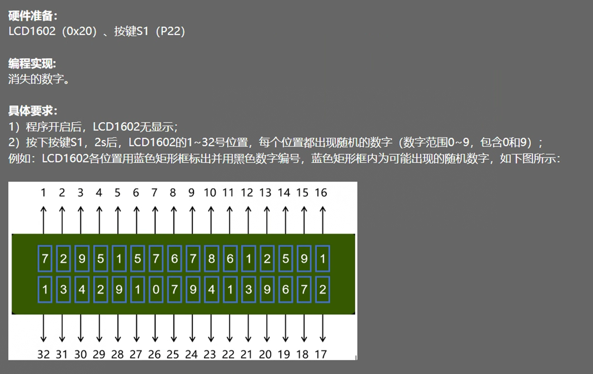

# 米思奇题解

# 思路
## 使用二维数组，[[0,0,0],[1,0,0],[2,0,0]]，数组每个元素为一个3元素一维数组，存储1602列值、行值、数值
## 使用for循环遍历数组，先将数值赋值为随机数，再使用for循环遍历，找到最大值，再使用for循环遍历，获取最大值的项的列值和行值，将该位置显示为空格，并将最大值改为-1.
## 由于只有32个数字，每消除一个数字将计数加1，直到加到32后跳出循环